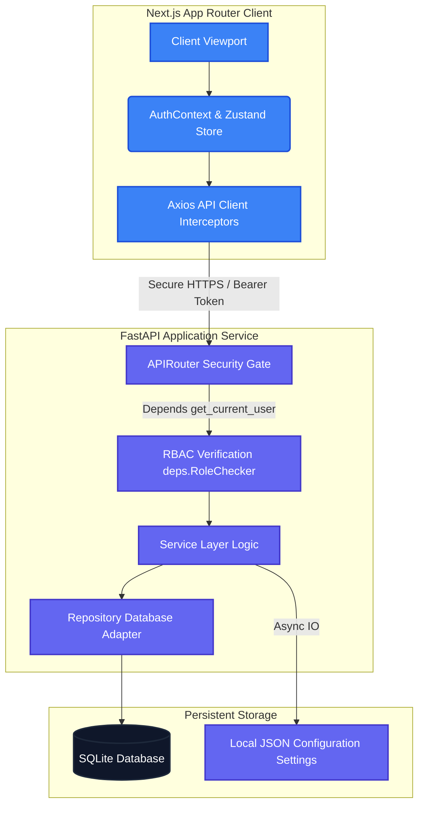
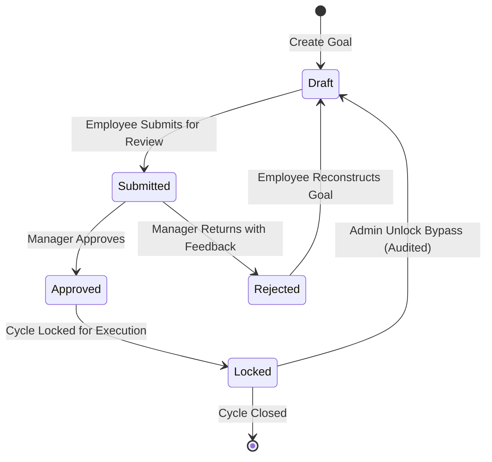
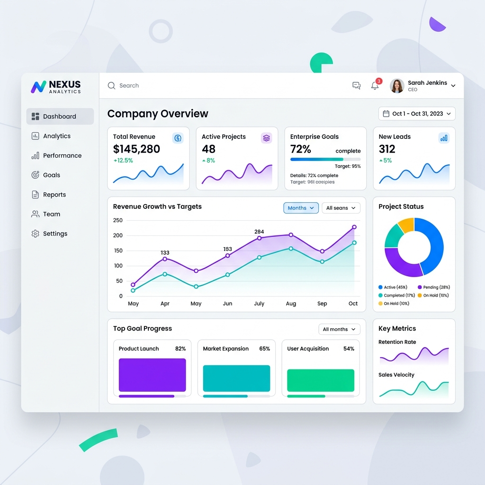

# 🎯 GoalForge AI — Enterprise Performance Orchestration


GoalForge AI is a premium, production-grade enterprise alignment platform that transforms static goal tracking into intelligent, high-velocity performance execution. Engineered using a modern full-stack architecture, it combines a robust **FastAPI backend** with a highly-polished, responsive **Next.js App Router frontend** to synchronize organizational pillars, automate cycles, and deliver cryptographic execution audits.

---

## 🚀 Architectural Blueprint & Data Flows

### 1. Unified System Architecture
The platform is decoupled into a high-performance backend API service and a fast, statically optimized Next.js client.



---

### 2. Goal Lifecycle & Security Transitions
GoalForge AI implements a strict state machine to prevent unauthorized goal manipulation. Once a goal is **Submitted** or **Approved**, it is programmatically locked. Any subsequent alterations require an official **Admin Unlock Bypass** backed by audited reasons.



---

### 3. Role-Based Access Control (RBAC) & Router Gateways
GoalForge AI handles authentication via secure JSON Web Tokens (JWT) with automated silent refresh loops. Users are routed dynamically based on cryptographically verified server-side roles:

```mermaid
flowchart TD
    %% Styling
    classDef gate fill:#f59e0b,stroke:#d97706,stroke-width:2px,color:#fff;
    classDef role fill:#10b981,stroke:#047857,stroke-width:2px,color:#fff;
    classDef page fill:#8b5cf6,stroke:#6d28d9,stroke-width:2px,color:#fff;

    A[User visits /login] --> B[Submit Credentials]
    B --> C{Verify Auth Token}
    C -->|Invalid| D[Redirect to /login]
    C -->|Valid JWT role| E{Evaluate Role}
    
    E -->|admin| F[Admin Portal Gateway]
    E -->|manager| G[Manager Command Center]
    E -->|employee| H[Personal Workspace]
    
    F --> I[/admin/dashboard]
    G --> J[/manager/dashboard]
    H --> K[/employee/dashboard]

    class C,E gate;
    class F,G,H role;
    class I,J,K page;
```

---

## 🔥 Key Technical Highlights

### ⚡ Elegant Dashboard Hydration
All chart rendering states are completely insulated using Next.js **Dynamic client-only dynamic imports** with SSR disabled. This eliminates hydration mismatches, resulting in flawless rendering and instant layout stability:
```typescript
import dynamic from 'next/dynamic';

const QuarterlyComparisonChart = dynamic(
  () => import('@/components/analytics/QuarterlyComparisonChart').then(mod => mod.QuarterlyComparisonChart),
  { ssr: false }
);
```

### 🔒 Cryptographic Audit Logging
Every strategic change, manager approval, reassignment, or lock-bypass writes directly to a system-wide audit ledger that is completely tamper-resistant:
```python
# app/services/audit_service.py
audit = AuditService(db)
await audit.log_action(
    entity_name="Goal",
    entity_id=goal.id,
    action="FORCE_UNLOCK",
    actor_id=current_user.id,
    old_values={"status": old_status},
    new_values={"status": goal.status, "reason": payload.reason}
)
```

---

## 🎨 Professional Analytics & Metrics Center



*Organize, monitor, and scale team deliverables using real-time strategic alignment indexes.*

---

## 🔑 Default Enterprise Evaluation Credentials

To facilitate immediate local and live evaluation of all features, the system seeds three primary role personas all pre-configured with a master evaluation password:

| Role Persona | Email | Password | Access Scope |
| :--- | :--- | :--- | :--- |
| **System Administrator** | `dev@goalforge.ai` | `dev-password-local-only` | Org Settings, Cycle Controls, Force Unlock, Audit Logs |
| **Team Manager** | `manager@goalforge.ai` | `dev-password-local-only` | Team Analytics, Approvals, Performance Benchmarks, Coaching |
| **Employee Partner** | `employee@goalforge.ai` | `dev-password-local-only` | Personal Goals, AI Copilot, Achievements, Check-ins |

---

## 🛠️ Local Installation & Development Setup

### 📦 1. Backend Setup (FastAPI)
1. **Navigate to the root directory**:
   ```bash
   cd goal-forge-ai
   ```
2. **Create and activate a virtual environment**:
   ```bash
   python -m venv venv
   source venv/bin/activate  # On Windows: .\venv\Scripts\activate
   ```
3. **Install dependencies**:
   ```bash
   pip install -r requirements.txt
   ```
4. **Initialize and Seed the Database**:
   ```bash
   python init_db.py
   python app/db/seed.py
   ```
5. **Run the Backend server**:
   ```bash
   uvicorn app.main:app --host 0.0.0.0 --port 8000 --reload
   ```

### 💻 2. Frontend Setup (Next.js)
1. **Navigate to the frontend directory**:
   ```bash
   cd frontend
   ```
2. **Install node dependencies**:
   ```bash
   npm install
   ```
3. **Configure Environment Variables**:
   Create a `.env.local` file inside the `frontend` folder:
   ```env
   NEXT_PUBLIC_API_URL=http://localhost:8000/api/v1
   ```
4. **Launch the development server**:
   ```bash
   npm run dev
   ```

---

## 🚀 Docker & Cloud Deployment

### 🐳 Containerized Production Build
The backend service includes a fully-optimized `Dockerfile` for seamless deployment to Hugging Face Spaces, Render, or AWS:

```bash
docker build -t goalforge-backend .
docker run -d -p 8000:8000 --name goalforge-service goalforge-backend
```

### 🌐 Secure Vercel Deployment Settings
When deploying the frontend to Vercel, ensure that:
1. **Deployment Protection** is disabled in Project Settings (to avoid CORS/redirection blockage).
2. The environment variable **`NEXT_PUBLIC_API_URL`** is set to **`https://...`** (with an **s** to prevent browser **Mixed Content** blocking).
